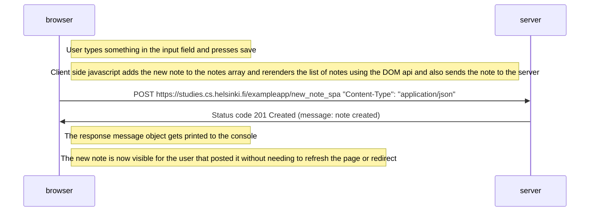

```mermaid
sequenceDiagram
    participant browser
    participant server
    Note right of browser: User types something in the input field and presses save
    Note right of browser: Client side javascript adds the new note to the notes array and rerenders the list of notes using the DOM api and also sends the note to the server
    browser->>server: POST https://studies.cs.helsinki.fi/exampleapp/new_note_spa "Content-Type": "application/json"
    server->>browser: Status code 201 Created (message: note created)
    Note right of browser: The response message object gets printed to the console
    Note right of browser: The new note is now visible for the user that posted it without needing to refresh the page or redirect
```