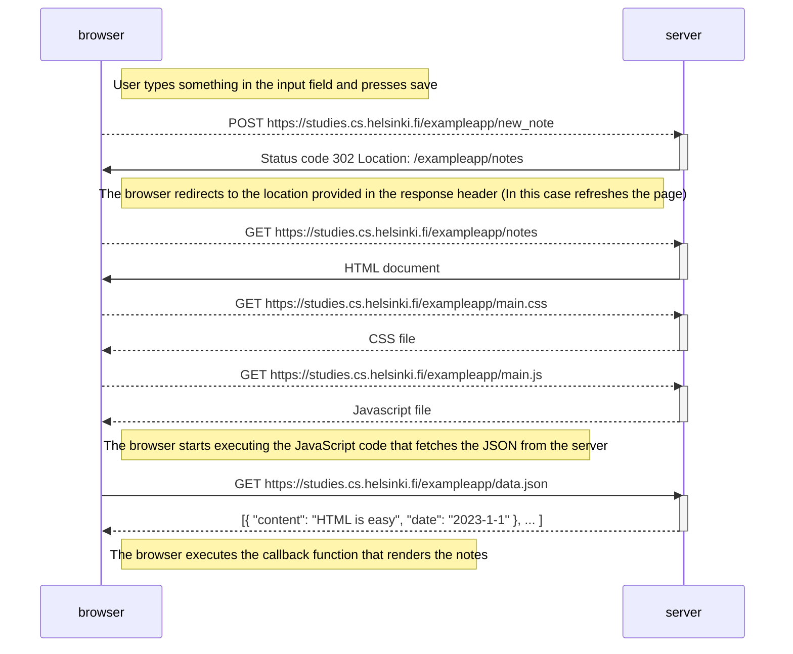

```mermaid
sequenceDiagram
    participant browser
    participant server
    
    Note right of browser: User types something in the input field and presses save
    browser-->>server: POST https://studies.cs.helsinki.fi/exampleapp/new_note 
    activate server
    server->>browser: Status code 302 Location: /exampleapp/notes
    deactivate server
    Note right of browser: The browser redirects to the location provided in the response header (In this case refreshes the page)
    browser-->>server: GET https://studies.cs.helsinki.fi/exampleapp/notes
    activate server
    server->>browser: HTML document
    deactivate server
    browser-->>server: GET https://studies.cs.helsinki.fi/exampleapp/main.css
    activate server
    server-->>browser: CSS file
    deactivate server
    browser-->>server: GET https://studies.cs.helsinki.fi/exampleapp/main.js
    activate server
    server-->>browser: Javascript file
    deactivate server
    Note right of browser: The browser starts executing the JavaScript code that fetches the JSON from the server
    browser->>server: GET https://studies.cs.helsinki.fi/exampleapp/data.json
    activate server
    server-->>browser: [{ "content": "HTML is easy", "date": "2023-1-1" }, ... ]
    deactivate server    
    Note right of browser: The browser executes the callback function that renders the notes 
```